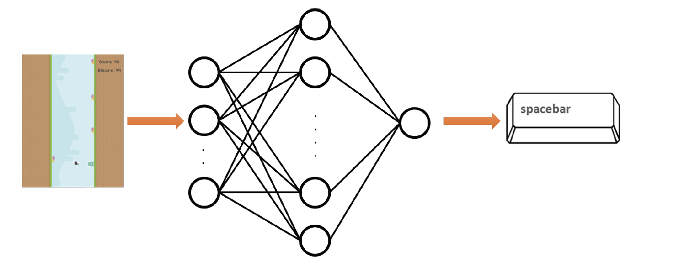

  <h1> In The Name Of GOD </h1>
  

# Snail Jumper
<!-- **Neuroevolution game assignment.**   -->
**Fall 2021 - Computer Intelligence.**  

## Introduction

This game has been developed as an assignment for students at Amirkabir University of Technology to apply neuroevolution using a simple game.\
In this project we will develop an Intelligent Player Agent to play a game called Snail Jumper.
The goal is to achieve as high as possible high score in the game and for this porpuse, we have applied Neuroevolution to our agent.\
**The details of the implementation of the agent and how we used Neuroevolution will be added soon in this repository with a video of the Agent playing the
game**

## Game Modes
* Manual  
* Neuroevolution

## Design
  
A neural network that takes important decision-making parameters under input and then generates the corresponding output were deigned.

And, the produced output is similar to pressing the space button defined in the game. Like described in the image below.

## Input Vector
The input vector, is based on the `player_x` and `player_y` position and position of `obstacales` and `screen_width` and `screen_height`.

## Neural Network 
The neural network has three layers:

* input layer
* one hidden layer
* output layer

## Evolution Part
In the evolution part desired steps were designed.

For the `next_population_selection` part we have the following options:

* Roulette Wheel Selection
* Stochastic Universal Sampling
* Q Tournament, in case of 2: binary tournament
